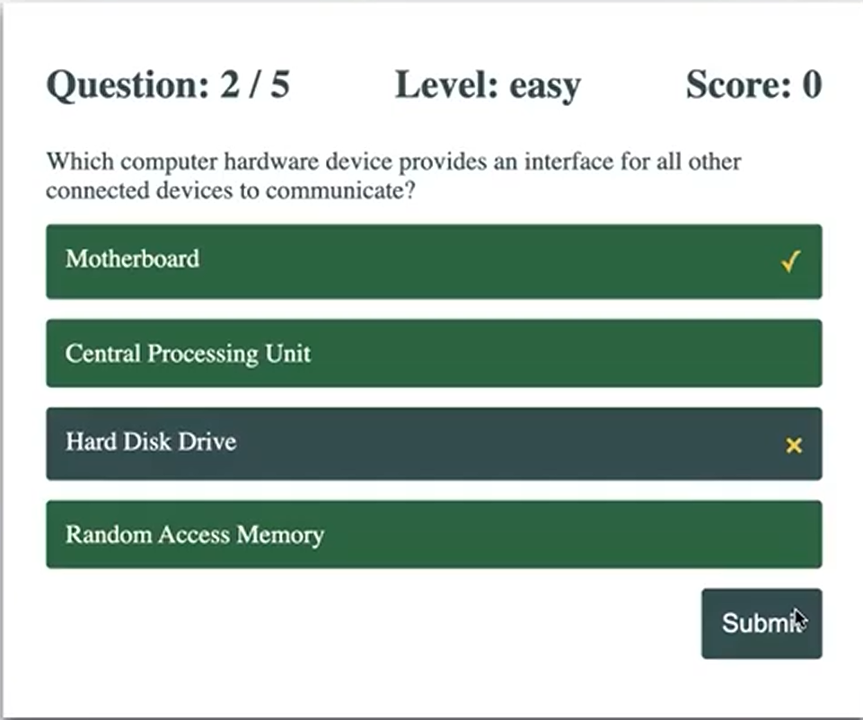

# API Trivia App Project 

This project is a Trivia App where users can play a trivia game from an openDB database of questions. The category and difficulty can be adjusted to the user's preference. The correct or incorrect answers are displayed after each question, and the score screen is shown at the end of the quiz.

---

## Frontend

- **Technologies**:
  - HTML5
  - CSS3
  - JavaScript
- **Techniques**:
  - Responsive web design techniques

---

## Backend

- **Technologies**:
  - APIs

---

## Tools

- **Version Control**:
  - Git and GitHub
- **Code Editor**:
  - Visual Studio Code (with Live-Server Extension)

---

