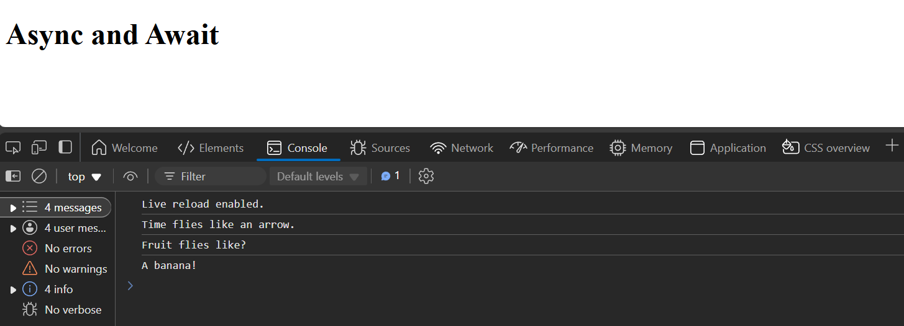

# Async JS Promises Practice 

This project demonstrates the creation of async functions in JavaScript and how they interact with the console log.

---

## Frontend

- **Technologies**:
  - HTML5
  - CSS3
  - JavaScript

---

## Tools

- **Version Control**:
  - Git and GitHub
- **Code Editor**:
  - Visual Studio Code (with Live-Server Extension)

---

