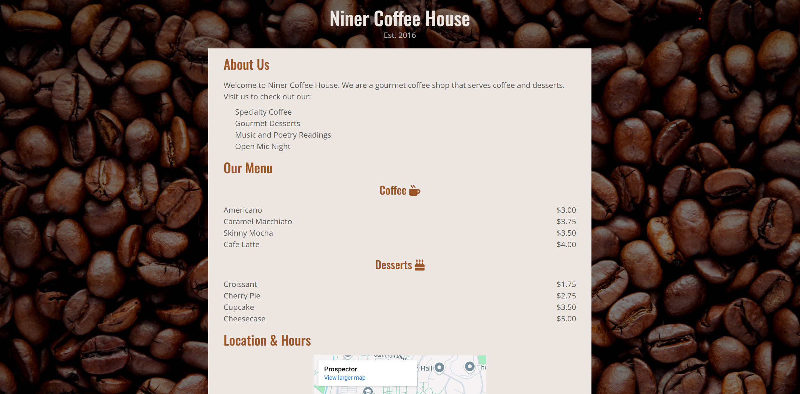

# Coffee Shop CSS Practice

This practice is a display-oriented example of how to design a simple webpage, such as a coffee shop. It implements basic CSS to create an organized and creative design for an HTML file.

---

## Frontend

- **Technologies**:
  - HTML5
  - CSS3

---

## Tools

- **Version Control**:
  - Git and GitHub
- **Code Editor**:
  - Visual Studio Code (with Live-Server Extension)

---

