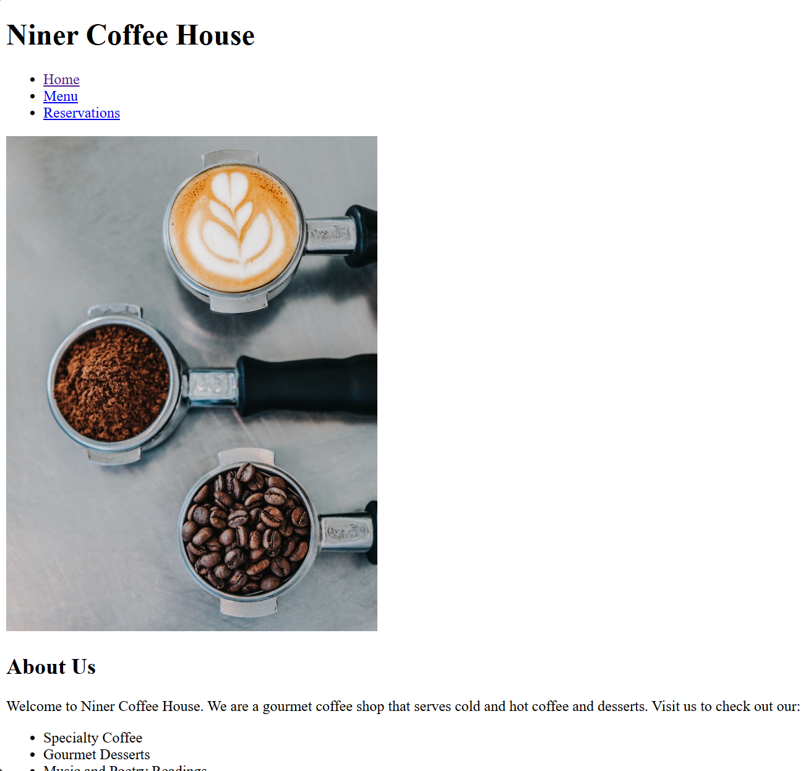

# Coffee Shop HTML Practice 

This simple HTML site is the first HTML practice I did. It showcases a simple layout with multiple organization and layout techniques, such a bullet points and correct spacing. 

---

## Frontend

- **Technologies**:
  - HTML5

---

## Tools

- **Version Control**:
  - Git and GitHub
- **Code Editor**:
  - Visual Studio Code (with Live-Server Extension)

---

