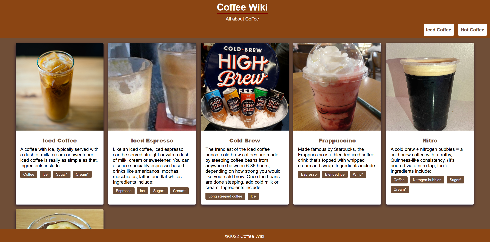

# Coffee Shop JS Practice 

This practice is a coffee shop website to demonstrate JS interaction when clicking different buttons. The user can display iced or hot coffee to load different JS files and display the corresponding coffee in an organized format.

---

## Frontend

- **Technologies**:
  - HTML5
  - CSS3
  - JavaScript
- **Techniques**:
  - Responsive web design techniques

---

## Tools

- **Version Control**:
  - Git and GitHub
- **Code Editor**:
  - Visual Studio Code (with Live-Server Extension)

---

