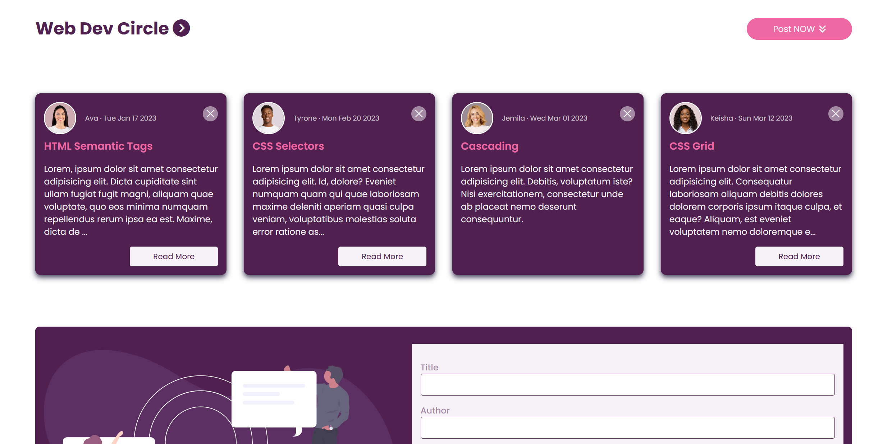

# DOM Manipulation JS Practice 

This practice is a demonstration of how DOM manipulation occurs within JS. It displays this on the Event Handler demonstration site. 

---

## Frontend

- **Technologies**:
  - HTML5
  - CSS3
  - JavaScript
- **Techniques**:
  - Responsive web design techniques

---

## Tools

- **Version Control**:
  - Git and GitHub
- **Code Editor**:
  - Visual Studio Code (with Live-Server Extension)

---

