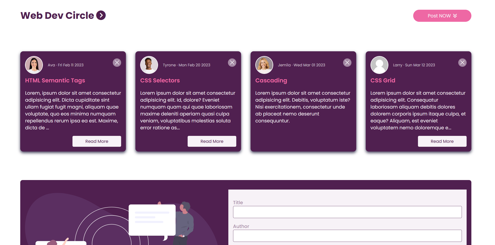

# Event Handler JS Practice 

This practice is a demonstration of how events are handled in JS. The user is able to interact with the site in different ways in order to create an interactive post-style experience.

---

## Frontend

- **Technologies**:
  - HTML5
  - CSS3
  - JavaScript
- **Techniques**:
  - Responsive web design techniques

---

## Tools

- **Version Control**:
  - Git and GitHub
- **Code Editor**:
  - Visual Studio Code (with Live-Server Extension)

---

