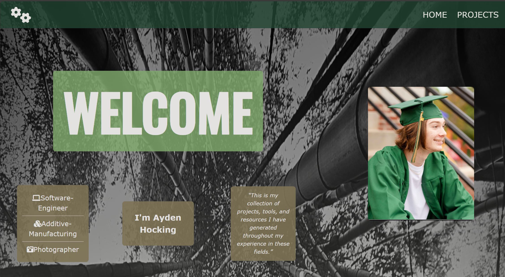

# Personal Site Project 

This project is a personal site to display a combination of my HTML and CSS abilities, as well as integrate my personal hobbies into a web design environment. The website has responsive design elements to allow user functionality and unique hover and click effects to generate interaction with the page. The two pages display a landing page and a projects page, each with their own design groupings.

---

## Frontend

- **Technologies**:
  - HTML5
  - CSS3
- **Techniques**:
  - Responsive web design techniques

---

## Tools

- **Version Control**:
  - Git and GitHub
- **Code Editor**:
  - Visual Studio Code (with Live-Server Extension)

---

