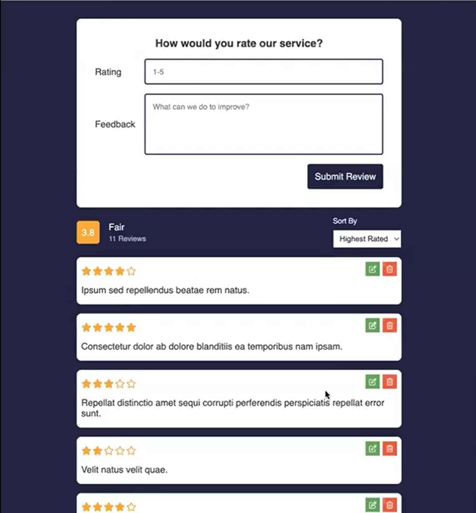

# Fetch and Rest API Review Page Project 
This project is a review handling center where user reviews are retrieved from a JSON server database. These reviews are organized and sorted according to user-selected criteria. Each review has a rating that contributes to determining the average rating score. Reviews can also be edited, deleted, or created within the site.
---

## Frontend

- **HTML5, CSS3, JavaScript**
- **Responsive web design techniques**

---

## Backend

- **APIs**
- **`.json` databases**
- **Node.js (`json-server@0.7.19`)**

---

## Tools

- **Git and GitHub for version control**
- **Visual Studio Code (Live-Server Extension)**:

---

