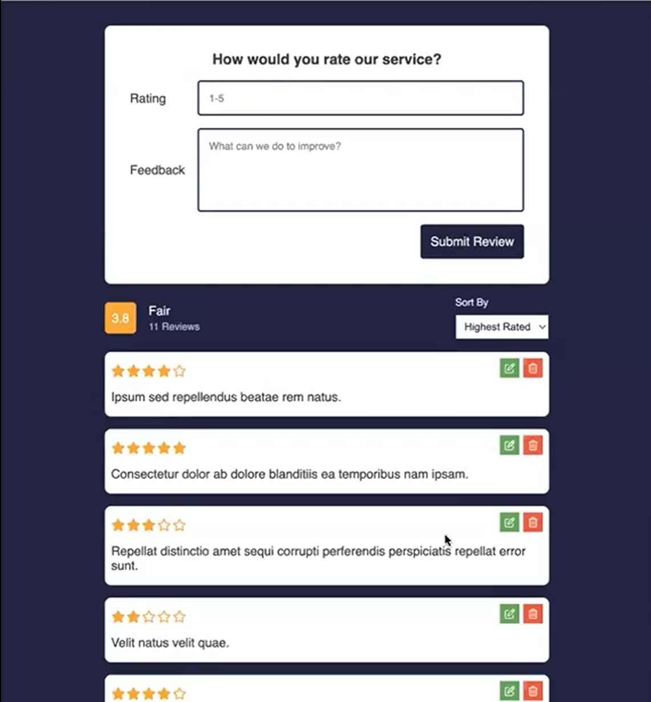

# Review Page with Fetch and Rest API Project

This project is a review page in which users can add, edit, and remove reviews from a JSON database. It uses a star review system to calculate average scores and organize the reviews across the page. The user can adjust the organization method based on their preference.

---

## Frontend

- **Technologies**:
  - HTML5
  - CSS3
  - JavaScript
- **Techniques**:
  - Responsive web design techniques

---

## Backend

- **Technologies**:
  - APIs
  - `.json` databases
  - Node.js (`json-server@0.7.19`)

---

## Tools

- **Version Control**:
  - Git and GitHub
- **Code Editor**:
  - Visual Studio Code (with Live-Server Extension)

---

