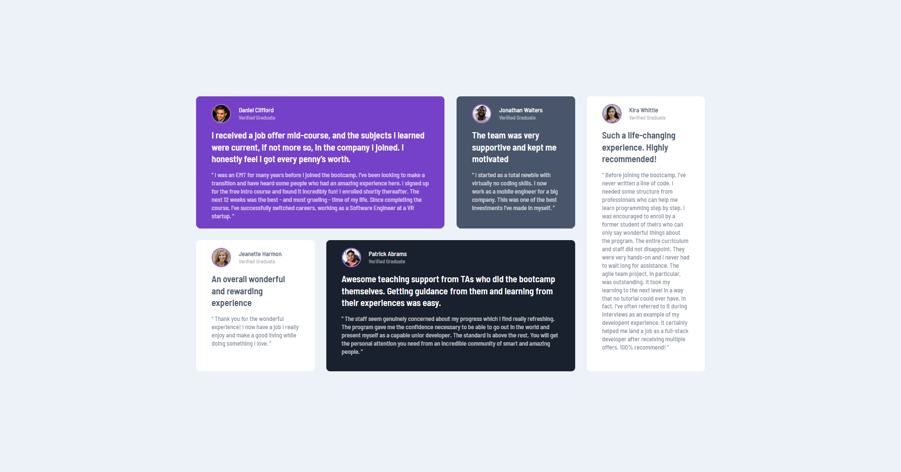

# Testimonial Responsive Design CSS Practice

This project is a demonstration of how cards can be organized on different devices. It uses responsive design to arrange multiple cards in different layouts. This provides better user functionality for phone, tablet, and desktop devices.

---

## Frontend

- **Technologies**:
  - HTML5
  - CSS3
- **Techniques**:
  - Responsive web design techniques

---

## Tools

- **Version Control**:
  - Git and GitHub
- **Code Editor**:
  - Visual Studio Code (with Live-Server Extension)

---

